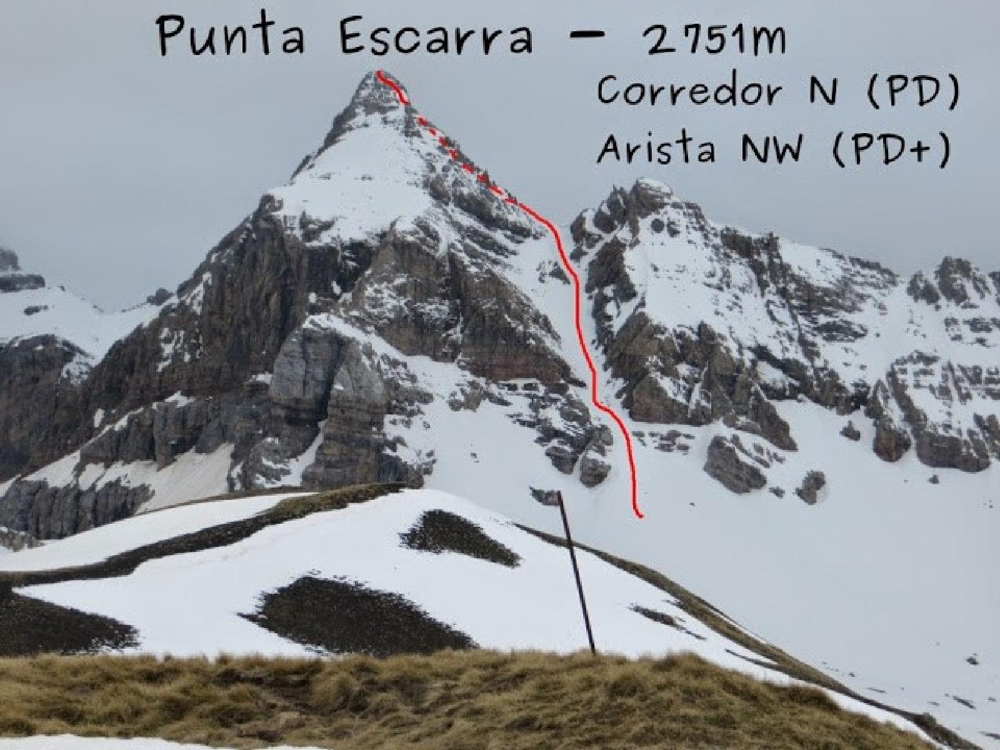

## Iniciación al alpinismo invernal

> Una ruta con un poco de todo, aproximación con esquis, corredor que se va empinando y ultimo tramo con roca. Para bajar algún rapel y si la cosa esta en condiciones y te animas bajadon esquiando del corredor.

## Alpinismo invernal-Corredor Punta escarra

Despues de barajar varias posibilidades, acabamos por intentar ir a bajar el corredor de la punta Escarra con esquis. Emocionados por ser nuestro primer destino de esquí un poco mas duro, nos juntamos, David "petaladeras", Fer, Ceci "el incansable" e Iris (que era la primera vez que hacia un corredor). Salimos desde el parquin de Sarrios de Formigal hacia el evidente collado que nos llevaría hacia Izas. Una vez en el collado despues de una buena sudada al solcico.

  
¿Que hacemos? media ladera, ¿con focas o sin focas?, empezamos con focas, luego algunos las quitamos. Aventurilla aventurilla. Por fin estamos a pie de corredor, nos calzamos los crampones y para arriba, los esquis los dejamos porque la nieve esta bastante durita y venteada en el corredor.  
Poco a poco avanzamos, Iris se maneja bien, justo antes del collado la cosa se pone pina, pero se sube bien.  
Iniciamos el ataque a la cumbre, con un pasito en de roca, luego una travesia por una faja. Otro poco de roca esta vez echamos la cuerda a Iris. La cosa se complica ahora me pongo la cuerda yo tambien. Las paso canutas en algunos pasos, la nieve esta blanda y debajo hay placas de roca, rasco con el piolet pero no cojo nada. Bueno voy progresando, llegamos por fin a la cima.

Iris esta emocinada con la actividad. Ahora tocan los rapeles hasta el collao, de ahí para abajo, despacico y con buena letra. Llegamos a los esquis, diagonal infernal y ponemos focas, todos, no, Ceci sube al cordal si ponerse focas y sin soltarse el talón, pedazo de titan. Que calor subimos y bajamos por la cresta agotados hasta que llegamos encima del collado que habíamos cruzado por la mañana. Por fin bajada se me hace muy dura la mochila pesa mas de lo debido y estoy agotado. Oehhhhhh, ya estamos en el coche tras una bajada de esquí supervivencia.

Recorrido: [https://gl.wikiloc.com/rutas-alpinismo/20140423-punta-escarra-corredor-n-6666508](https://gl.wikiloc.com/rutas-alpinismo/20140423-punta-escarra-corredor-n-6666508)

Otra actividad similar: [Corredor Norte del Aspe](https://elpequenosaltatapias.com/alpinismo/corredor-norte-del-aspe/)

* * *
