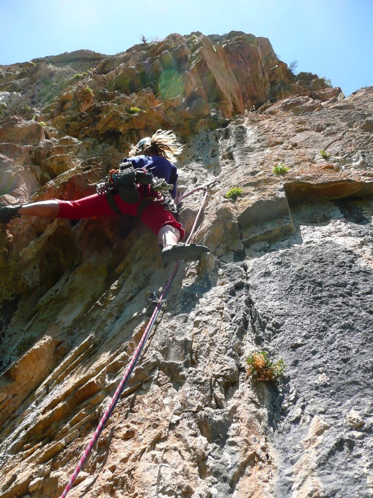
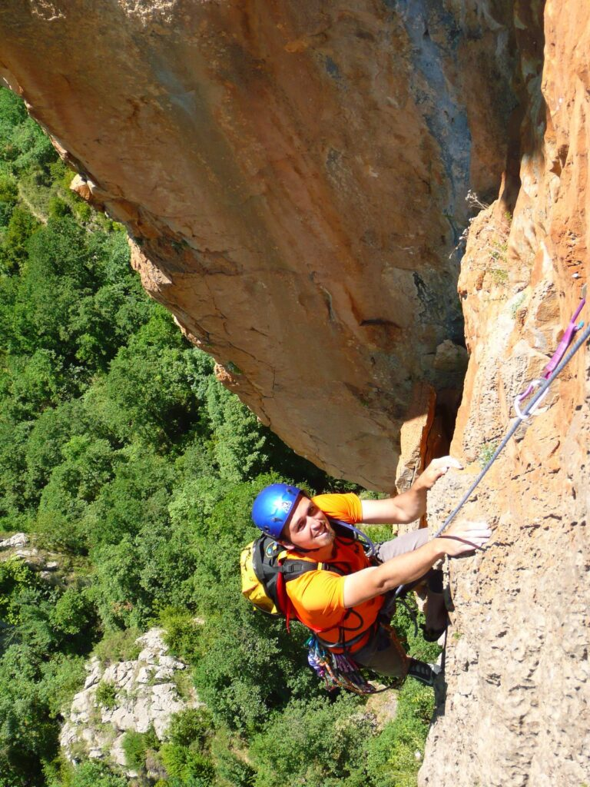

> Rutón de varios largos tirando a escalada deportiva. Muy disfrutable

## Besa o muere

Una ruta que nos dejó con muy buen sabor de boca de camino a Benasque. Recomendable totalmente, sobre todo si te mueves en esos grados 7a. La entrada está un poco rota, pero después es muy disfrutona. Empieza a desplomar desde el principio y ojo con la sombra que no tiene ;) La entrada al valle de Benasque con el coche por el congosto es un infierno, pero para escalar te hará olvidar las estrecheces. La vía es de continuidad principalmente así que ir con las pilas cargadas.

## Congosto del ventamillo

Este finde la cosa estaba chunga, tenia visita familiar el domingo así que solo podría escalar el sabado. Tras el sondeo inicial, la pandilla curraban todos excepto [Olatz y David](\"http://apretarlojusto.blogspot.com/\"). Pero ellos querían irse todo el finde. Finalmente dicen de ir al Congosto, a mi me apetecía bastante esta pared y como estaba crecido "pallí" que me fuí. Tras el viajecito cruzando los pirineos. Por fín llegamos, la via elegida **besa o muere**. La aproximación, pues como siempre evidente cruzas el rio por una pasarela de cemento que da bastante cague y despues una sendica te lleva a ningún sitio para despues acabar haciendo el jabalí. Siempre nos ocurre lo mismo.

<figure>

<figcaption>

Pasarela del horror

</figcaption>

</figure>

Es la primera vez que hacía pared en la misma cordada con [David y Olatz](\"http://apretarlojusto.blogspot.com/\"). David decide darle al primer largo él, así el segundo mas duro me tocaría a mi, como estaba crecido no me importó. En los primeros metros la dificultad esta en procurar no coger nada que se caiga, tarea arduo dificil, despues la roca mejora y salen unos movimientos sensacionales.

<figure>

<figure>

<figcaption>

Pie de vía

</figcaption>

</figure>

<figure>

<figcaption>

Olatz en el primer largo

</figcaption>

</figure>

<figcaption>

Primer largo de Besa o Muere

</figcaption>

</figure>

Segundo largo, me toca. Comienzo animado hasta una travesia que jodooooooooooo!, me cuelgo cojo el canto del final, se me acabo el estado crecido, que cantacos y que hinchao estoy, largo GLORIOSO, eso si me arrastre cual babosa. David el muy perro se lo lleva.

<figure>

<figure>

<figcaption>

Llegando a la R2

</figcaption>

</figure>

</figure>

Es el turno de Olatz, empieza llorando, que esteis atentos, que le hagamos caso, David me comenta que es normal, que en cuanto ya no pueda hablar con nosotros subirá en fuego y así ocurrió. Acaba el largo y ya lo quiere decotar, que sobrada. Otro largito maravilloso con una placa de pequeños agarres pinchudos sensacional.

<figure>

<figure>

<figcaption>

Olatz dandole al tercer largo

</figcaption>

</figure>

<figure>

<figcaption>

David aplicandose

</figcaption>

</figure>

<figure>

<figcaption>

Llegando a la R

</figcaption>

</figure>

<figure>

<figcaption>

4º largo

</figcaption>

</figure>

<figure>

<figcaption>

David!! Olatz me pegaaaaaa!!

</figcaption>

</figure>

<figure>

<figcaption>

Matojotracción

</figcaption>

</figure>

</figure>

Y por último yo otra vez en un larguito un poco guarro con final a las finas hierbas.

Salimos por una canal guarrisima, en matojotraccion, y a buscar los rapeles.  
Fin de la matojotraccion.

Empezamos los rapeles, estan equipados cada 30 o 35, empalmamos los dos primeros, el tercero lo hacemos corto, el cuarto intentamos empalmarlo pero David dice que las cuerdas no llegan al suelo, así que ala a remontar por la cuerda. Sudada de David y un último rapel. Ya estamos en el suelo y ahora por donde se baja, despues de varios intentos jabalineros decidimos, ir por la pared hasta el inicio de la via para coger por donde habiamos subido, y otra vez a hacer el jabalí. Por fin en el coche, llevo arañazos y pinchazos por todo el cuerpo. Feliz como una lombriz vuelta para casa.  
Mas pie mano y menos llorar.

## CROQUIS BESA O MUERE. cONGOSTO DEL VENTAMILLO

Es una zona con restricciones. Sed respetuosos. Iformación de las restricciones aquí: [https://escaladasostenible.org/regulacion/congosto-del-ventamillo/](https://escaladasostenible.org/regulacion/congosto-del-ventamillo/)

* * *
