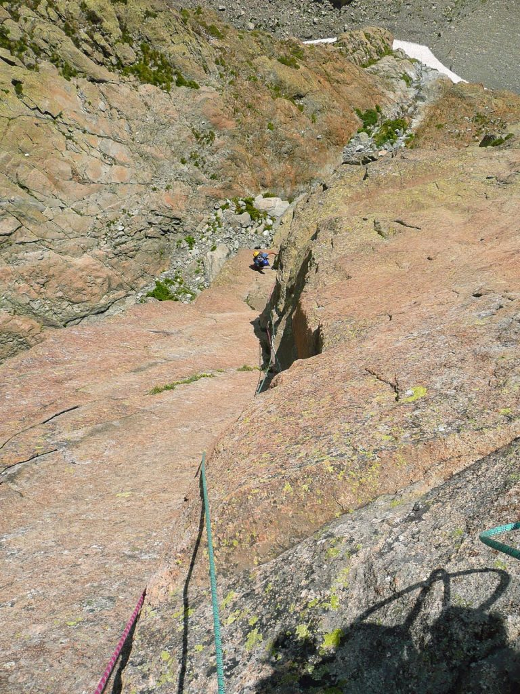
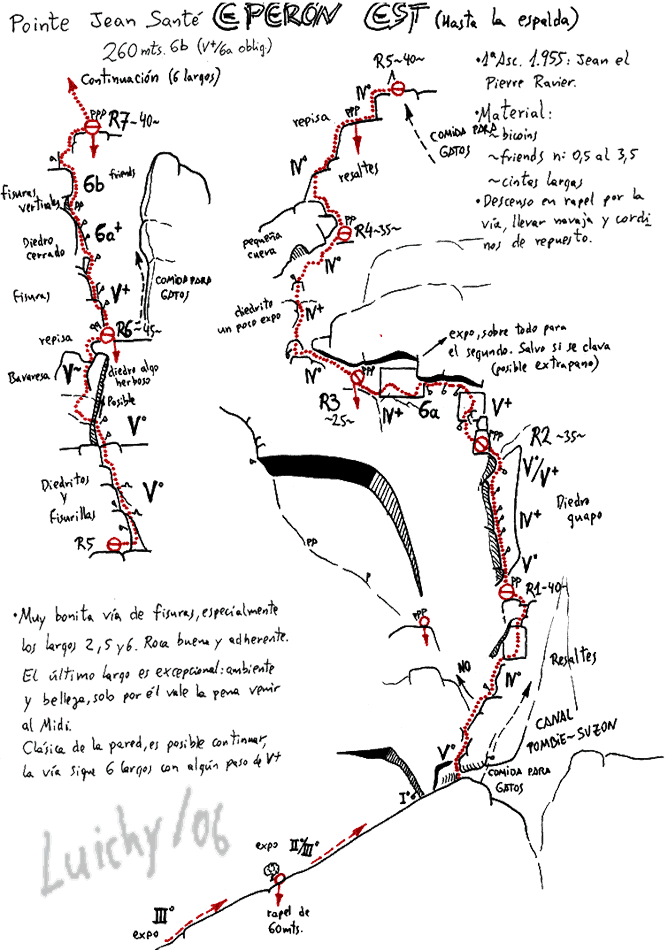

> Rutón con alguna apretada buena

## MIdi d'ossau

Pues eso, aprovechando la situación, nos vamos Olatz y yo al Midi, ya que Esco no quiere venir. Tenemos idea de ir a la surplombs, pero Olatz decide coger más reseñas por si acaso. Y menos mal porque acabamos haciendo el espolón este porque el resto de vías que llevábamos estaba petao. Para allí que vamos, decidimos hacer la vira en ensamble, o eso creíamos es bastante complicada de asegurar, y la hacemos sin poner nada más que un para de reuniones cutres que encontramos. Comienza la vía, empiezo yo, un pasito de entrada curioso y a correr.

El siguiente largo Olatz lo sube silvando: ).

Bueno, el siguiente pone \\"travesía expuesta\\" pues cojonudo, una travesía finita y de no caerse.  
Olatz sube regañando:-\\"con lo que me gustan estas travesías\\"  
\-\\"al loro ehh\\"  
Bueno, pero al final pasa sin problemas.  
Otros dos larguitos de trámite, y el último largo, desde abajo acojona, empieza por una fisurita de dedos y luego una bastante ancha, pasa por unos tramos atléticos y tachannnnnn, ya estoy en la R menos mal porque ya no me quedaban cintas XD. Me la llevo.

Sin perder mucho tiempo p\\'abajo que en el midi se pasa más miedo bajando que subiendo. En fin, sin demasiados contratiempos llegamos a la vira y a destrepar hasta un arbolito desde donde en un rapel de 60 m llegamos al suelo. En conjunto, vía normalita para mi gusto.  
Ya sabéis la otra cara de la moneda en [apretar, lo justo](http://apretarlojusto.blogspot.com/).

* * *

## Croquis espolon Este

