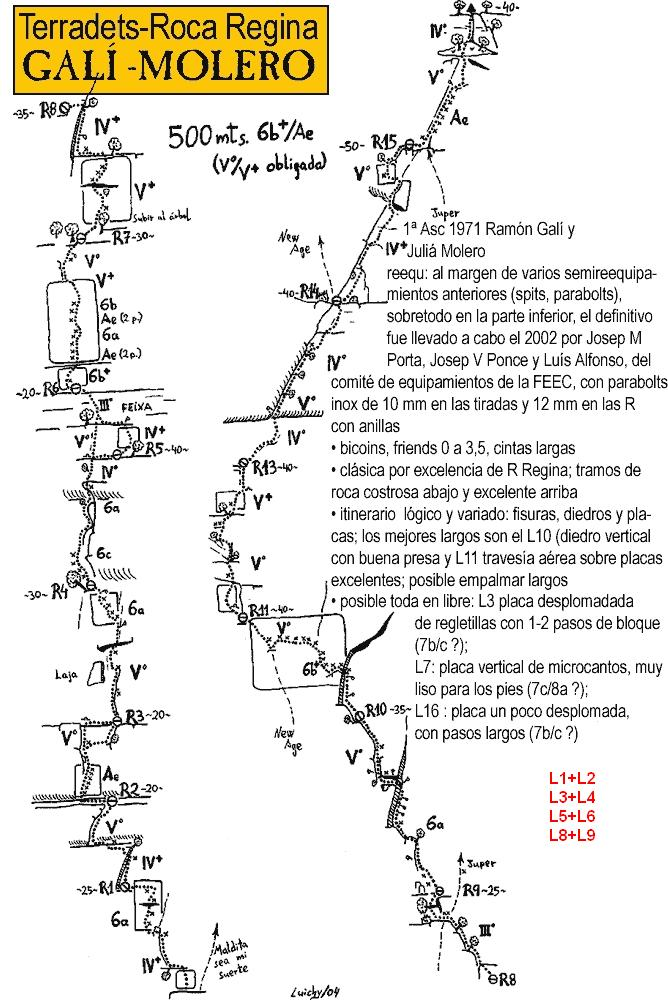

> Paredon largo donde los haya. Escalada para "hombre" se decia en la epoca. No elegimos la más comprometida y nos la merendamos.

## Gali MOlero

Pues si, me deje convencer para irnos a escalar a roca Regina, la vía, la que eligió Olatz y que yo por supuesto proteste. Una vez más a Olatz y David les acompañaría "la cordada húmeda". "Extremo candente" y yo les seguiríamos cuáles fieles escuderos (bueno, así nos consolamos, somos bastante más lentos). La cosa pintaba mal, demasiados largos cuatrocientos y pico metros de tapia y mucho Ae para mi gusto. Una vez llegados a pie de vía tras una accidentada aproximación, Chambi y yo nos disponemos a llevar a cabo nuestro ritual de echar a suertes, quien empieza con el primer largo. Esta vez cambiamos de juego(normalmente jugábamos a pares o nones y siempre sacábamos el mismo número) esta vez sería piedra, papel o tijera. El mejor de tres vencería y comenzaría, tras cuatro intentos sacamos siempre lo mismo y quedamos empates. Menos mal que la última vez saque más tarde y Chambi cambio de elección con lo que gano. Os preguntaréis por qué no nos lo jugamos a cara o cruz, realmente pensamos que la moneda caería de canto.  
Comenzamos la via y hay que ir empalmando largos si no esto se eterniza, escalada curiosa con Ae y saliditas puñeteras. Tres largos y estamos en la Feixa.

  
Otros largos guarretes y estamos en un diedro con buena pinta, realmente es chulo, luego la famosa trave y los dos siguientes que también empalmamos, estos tres largos son lo mejor de la vía. Unos más de trámite y otro Ae para acabar. Al final lo dejamos en 11 largos creo. Cuando la cordada húmeda pensaba que llegaría con David y Olatz estos demarraron y David acabo echándose la siesta, otra vez. Ya sabéis más información y fotos en [Apretar, lo justo.](http://apretarlojusto.blogspot.com/search/label/Roca%20Regina)  
Bajada jabalinada, me encantan: ) Selva tropical por doquier, humedad y grandes setas. Cansados y contentos, cervecita y para Vilanova.

## CROQUIS GALI MOLERO. rOCA rEGINA

* * *
