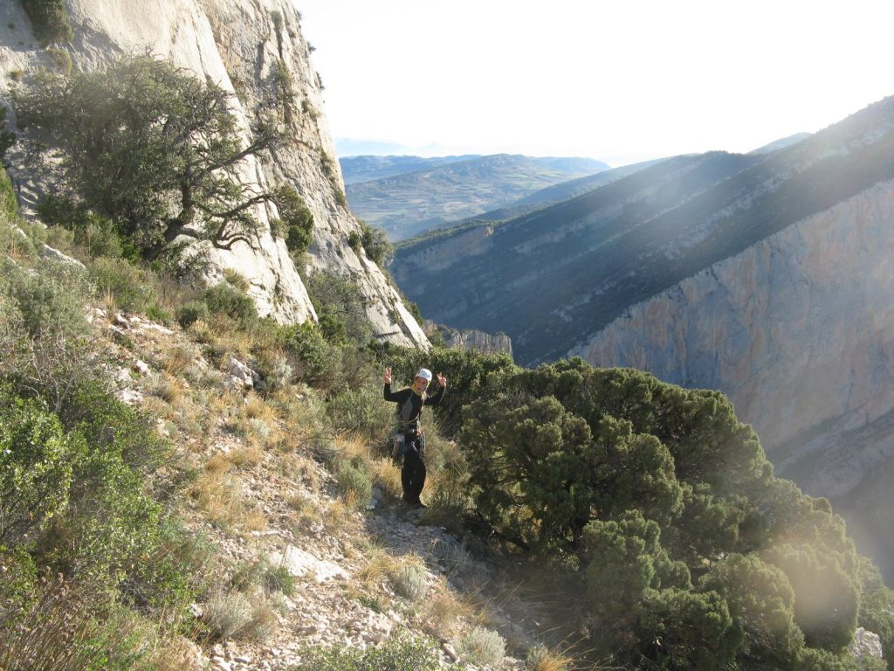
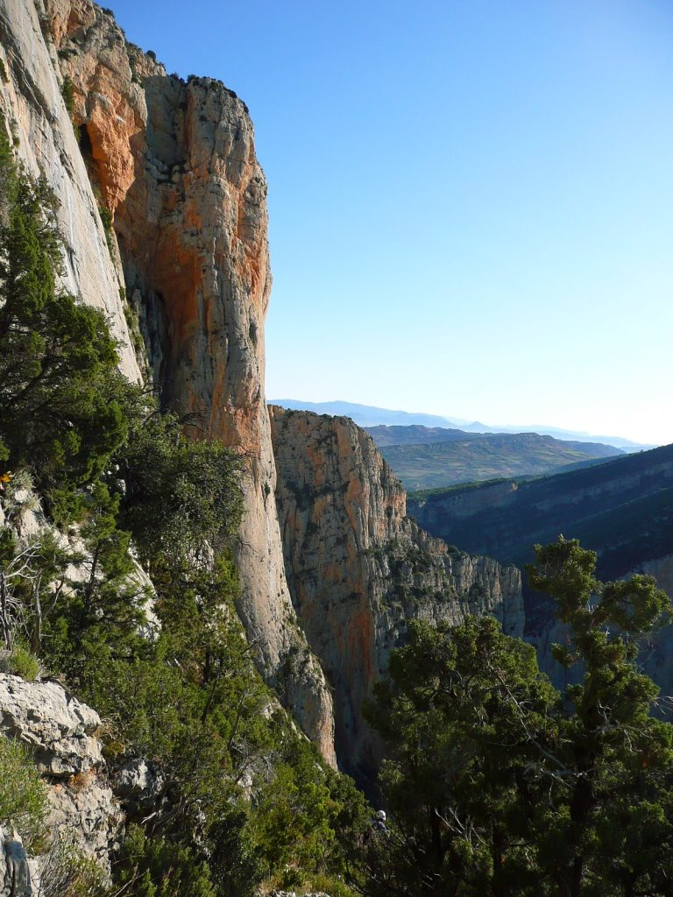
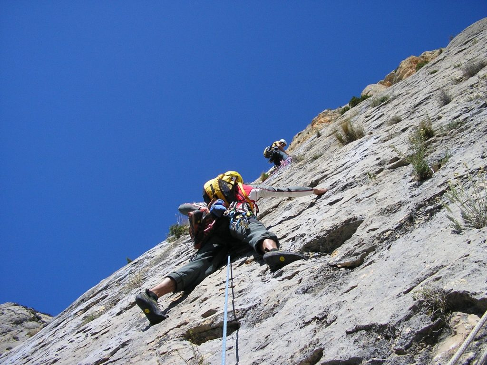

> Paredon largo donde los haya. Escalada para "hombre" se decia en la epoca. No elegimos la más comprometida y nos la merendamos.

## Pilastra del Voltors

Este finde lo teniamos reservado hacia tiempo para la inauguracion de la casa-albergue-refugio de los "empresarios" sr. Gaton y sra.Gloria. Para alli que nos fuimos toda la trupe, aprovechando que esta al lado de la pared de aragon y la de cataluña decidimos irnos a escalar una vieta de esas que dicen para "superhombres", como en Regina ya nos habiamos hecho "hombres", a mi me encomendaron ir a la Pilastra del Voltors, una vez mas la cordada humeda estaria allí para darlo todo, ademas se nos unio David "petaladeras" Lombas con lo que la cordada mutaba y se convertia en... (musica de metamorfosis de los Power Ranger) LA CORDADA HUMEDA HUMEANTE. Madrugamos un güevo y parte del otro, pero salimos tarde para variar : ) Nos esperaba una maravillos aprox. de unas 2 horitas que al final fueron 3. Primero subir al montsec por el paso de san miquel luego encontrar una vira que cruza y desciende por en medio de la pared con unos destrepillos de cuidadin que me mato, un rapel de 60m de un sabina seca (actualmente este rapel esta equipado), otro tramo de vira y una canal de ascenso hasta pie de via, en fin una ginkana digna del Gran prix.  
Jhony Walker Texas Ranger.

Al llegar a pie de via los tipicos comentarios: -pues me esperaba mas chunga la aprox. -no ha sido para tanto.Seran cabrones pues yo he pasao acojonao algún tramo. Ala al lio, [Olatz y Esco](\"http://apretarlojusto.blogspot.com/2009/10/punalada-trapera.html\") se van para la puñalada trapera, si si Olatz y Esco he dicho bien, David tambien iva a ir pero se rebano el dedo del pie cuando salia de la ducha y estaba convaleciente todavia. Nos montamos en la via, plaquita bonita de buena caliza, larguito de apretar con muchos seguros, dos larguitos guarretes con paso extraño, largo facil y guarro al final.

<figure>

<figure>

<figcaption>

OLYMPUS DIGITAL CAMERA

</figcaption>

</figure>

</figure>

  
Los vecinos de via.

Por fin un diedrazo de buena roca y cacho de me molo escalando, y otro largo facil y roto. Y ya se ha acabao, pues vaya con esto no nos dan la capa de superhombres.

<figure>

<figure>

<figcaption>

OLYMPUS DIGITAL CAMERA

</figcaption>

</figure>

<figure>

<figcaption>

OLYMPUS DIGITAL CAMERA

</figcaption>

</figure>

<figure>

<figcaption>

OLYMPUS DIGITAL CAMERA

</figcaption>

</figure>

<figure>

<figcaption>

OLYMPUS DIGITAL CAMERA

</figcaption>

</figure>

<figure>

<figcaption>

OLYMPUS DIGITAL CAMERA

</figcaption>

</figure>

</figure>

David nos esta esperando en la salida. Olatz y Esco llegan a continuacion, y en principio a Olatz ni le ha cambiao la voz ni na, pues esto de los superhombres debe de ser un mito : D es que soy muy inocente y me lo creo todo.

<figure>

<figure>

<figcaption>

OLYMPUS DIGITAL CAMERA

</figcaption>

</figure>

<figure>

<figcaption>

OLYMPUS DIGITAL CAMERA

</figcaption>

</figure>

</figure>

<figure>

<figure>

<figcaption>

OLYMPUS DIGITAL CAMERA

</figcaption>

</figure>

<figure>

<figcaption>

OLYMPUS DIGITAL CAMERA

</figcaption>

</figure>

<figure>

<figcaption>

OLYMPUS DIGITAL CAMERA

</figcaption>

</figure>

<figure>

<figcaption>

OLYMPUS DIGITAL CAMERA

</figcaption>

</figure>

<figure>

<figcaption>

OLYMPUS DIGITAL CAMERA

</figcaption>

</figure>

<figure>

<figcaption>

OLYMPUS DIGITAL CAMERA

</figcaption>

</figure>

<figure>

<figcaption>

OLYMPUS DIGITAL CAMERA

</figcaption>

</figure>

</figure>

Ahora solo queda pateadita de 2h y llegamos a la furgo. Pal refu donde no pretamos una buena cena unas cervezas, una duchita, unos pacharanes. En fin de festival total. [Marta](\"http://martaalejandrehimalaya8000.blogspot.com/\") nos amenizo la tarde con la fotos de su ultima expedicion. Domingo paseito comida y para casa, que el lunes curro.

<figure>

<figure>

<figcaption>

OLYMPUS DIGITAL CAMERA

</figcaption>

</figure>

<figure>

<figcaption>

OLYMPUS DIGITAL CAMERA

</figcaption>

</figure>

</figure>

La reseña como casi siempre de [Luichi](\"http://www.onaclimb.com/\")

## croquis pilastra dels voltors.

* * *

## Aproximación

